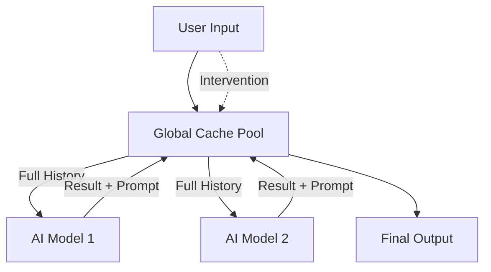

# NeuraCollab

A powerful chain-based AI collaboration system with dynamic prompt workflows.

## Core Features

- 📝 **Global Text Cache Pool**: Maintains complete history of all collaboration steps
- 🔄 **Dynamic Version Trees**: Support for branching explorations and parallel paths
- 🧠 **Intelligent Context Management**: Automatic compression of long histories while preserving key information
- 🎭 **Multiple Collaboration Modes**: Support for relay writing, structured debates, and custom workflows
- 👥 **Deep User Integration**: Allow user intervention at any point in the workflow

## Architecture



### Key Components

1. **Cache Pool**: Central storage system for all collaboration steps
2. **Workflow Engine**: Orchestrates the collaboration process
3. **Context Manager**: Handles history compression and relevance filtering
4. **LLM Registry**: Manages multiple language model implementations

## Installation

```bash
# Clone the repository
git clone https://github.com/username/neuracollab.git
cd neuracollab

# Install in development mode with all extras
pip install -e ".[dev,openai,anthropic]"

# Or install from PyPI (when published)
pip install neuracollab                 # Basic installation
pip install "neuracollab[openai]"       # With OpenAI support
pip install "neuracollab[anthropic]"    # With Anthropic support
pip install "neuracollab[dev]"          # With development tools
```

## Development Setup

```bash
# Create and activate virtual environment
python -m venv venv
source venv/bin/activate  # On Windows: venv\Scripts\activate

# Install development dependencies
pip install -e ".[dev]"

# Run tests
pytest

# Format code
black neuracollab
isort neuracollab

# Type checking
mypy neuracollab
```

## Quick Start

```python
import asyncio
from neuracollab import NeuraCollab
from neuracollab.examples import OpenAILLM

async def main():
    # Initialize the system
    collab = NeuraCollab()
    collab.register_llm("gpt4", OpenAILLM(), set_default=True)
    
    # Start a relay-style writing workflow
    workflow_id = await collab.start_relay_workflow(
        initial_content="Once upon a time...",
        roles=["worldbuilder", "character_designer", "plot_developer"]
    )
    
    # Execute collaboration steps
    for _ in range(3):
        entry = await collab.execute_next_step(workflow_id)
        print(f"\nStep by {entry.author}:\n{entry.content}")
        
        # Optional: Add user input
        await collab.add_user_input(
            workflow_id,
            "User's editorial suggestions..."
        )

if __name__ == "__main__":
    asyncio.run(main())
```

## Collaboration Modes

### 1. Relay Mode
Multiple AI models take turns continuing the work, each with a specific role:

```python
workflow_id = await collab.start_relay_workflow(
    initial_content="Project outline...",
    roles=["researcher", "writer", "editor"]
)
```

### 2. Debate Mode
AI models engage in structured debate, supporting or challenging arguments:

```python
workflow_id = await collab.start_debate_workflow(
    topic="AI Ethics Question",
    initial_argument="Initial position...",
    max_rounds=3
)
```

### 3. Custom Workflows
Define custom collaboration patterns with specific rules:

```python
from neuracollab.models import WorkflowConfig

config = WorkflowConfig(
    mode="custom",
    prompt_template="Your custom prompt template...",
    inheritance_rules={
        "full_history": True,
        "last_3_steps": False,
        "prompt_chain": True
    }
)

workflow_id = await collab.start_custom_workflow(config, "Initial content...")
```

## Branch Creation

Create parallel exploration paths from any point:

```python
# Create a new branch
branch_id = collab.create_branch(
    base_id=workflow_id,
    new_prompt="Explore alternative approach..."
)

# Continue in the new branch
branch_entry = await collab.execute_next_step(branch_id)
```

## Advanced Usage

### Custom LLM Integration

Implement custom language model integrations:

```python
from neuracollab.engine import LLMInterface

class CustomLLM(LLMInterface):
    async def generate(self, prompt: str, **kwargs) -> str:
        # Your LLM implementation here
        return "Generated content..."
    
    def get_model_name(self) -> str:
        return "custom-llm"

# Register your custom LLM
collab.register_llm("custom", CustomLLM(), set_default=True)
```

### Context Compression

The system automatically handles context length limitations:

1. Maintains complete history in the cache pool
2. Intelligently compresses context when length exceeds limits
3. Preserves key information using information density scoring
4. Allows custom filtering rules per workflow mode

## Contributing

We welcome contributions! Please see [CONTRIBUTING.md](CONTRIBUTING.md) for guidelines.

## License

This project is licensed under the MIT License - see the [LICENSE](LICENSE) file for details.
