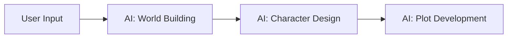
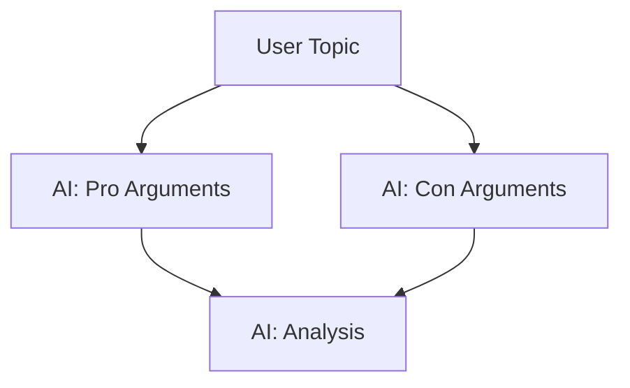

# NeuraCollab

A powerful AI collaboration platform with a global cache pool system.

## Core Features

- **Global Text Cache Pool**: Track and manage all AI interactions and user inputs
- **Dynamic Prompt Control**: Flexible prompt templates for different collaboration modes
- **Version Tree Management**: Support for branching and parallel exploration paths
- **Real-time User Intervention**: Seamless user intervention at any point in the workflow

## Quick Start

1. Install dependencies:
```bash
# Create virtual environment
python -m venv venv
source venv/bin/activate  # or `venv\Scripts\activate` on Windows

# Install Python dependencies
pip install -e .

# Install frontend dependencies
cd frontend
npm install
```

2. Set up environment variables:
```bash
cp .env.example .env
# Edit .env with your settings
```

3. Start the development server:
```bash
# Windows
run.bat

# Linux/macOS
chmod +x run.sh
./run.sh
```

The application will be available at:
- Frontend: http://localhost:5173
- Backend API: http://localhost:8000

## Collaboration Modes

### 1. Relay Creation
Chain multiple AI models for creative tasks:


### 2. Debate Mode
Structured AI debate with user moderation:


### 3. Custom Workflows
Create custom collaboration patterns using prompt templates:
```python
CUSTOM_PROMPT = """
Role: {role}
Task: {task}
Context: {context}
Rules: {rules}
"""
```

## Development

### Project Structure
```
neuracollab/
├── frontend/           # React + TypeScript frontend
├── neuracollab/       # Python backend
│   ├── adapters/      # LLM provider adapters
│   ├── cache_pool.py  # Global cache system
│   ├── engine.py      # Collaboration engine
│   └── server.py      # FastAPI server
├── tests/             # Test suite
└── docker/            # Docker configurations
```

### Running Tests
```bash
# Backend tests
pytest tests/

# Frontend tests
cd frontend
npm test
```

### Docker Development
```bash
# Build and start services
docker-compose up --build
```

## Documentation

- [API Reference](docs/api.md)
- [Contributing Guide](CONTRIBUTING.md)
- [Architecture Overview](docs/architecture.md)

## License

MIT License - see [LICENSE](LICENSE) for details.

## Contributing

1. Fork the repository
2. Create a feature branch: `git checkout -b feature-name`
3. Commit changes: `git commit -am 'Add feature'`
4. Push to branch: `git push origin feature-name`
5. Submit a pull request

Please read [CONTRIBUTING.md](CONTRIBUTING.md) for details on our code of conduct and development process.
